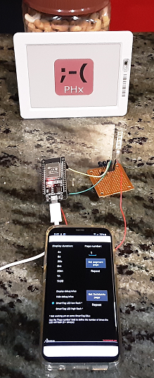

# []

# PricehaxESP32

This is an ESP32 based implementation of an IR transmitter for use with 
Furrtek's Android App or Python code for communicating with **infrared based**
Electronic Shelf labels.

For more information please see:

- https://github.com/david4599/PricehaxBT
- https://github.com/furrtek/PrecIR
- http://furrtek.free.fr/index.php?a=esl

## Why ?

When I became interested in PricehaxBT I didn't have a Arduino Nano or a
Bluetooth serial module, but I did have an ESP32. Since the ESP32 has 
Bluetooth as well as dedicated hardware for IR signaling it seemed 
like a natural.

## Hardware requirements

- ESP32
- infrared LED(s) and driver circuit

Build the interface using the PricehaxBT Dongle [schematic](https://github.com/david4599/PricehaxBT/blob/master/dongle/v3.2.0/PricehaxBT_IRDongle_sch.jpg),
just leave out the Arduino Nano and Bluetooth module and connect C1 to 
the ESP32's GPIO23.

## Build ESP32 firmware

1. [Install platformio](https://platformio.org/install) if you don't have it already.
2. cd into the root of this repo and run ````pio run -t upload````

## Testing

For the convenience of hardware debugging and LED alignment the firmware sends 
a burst of DotMatrix "SmartTag LED low flash" commands on reset. If everything 
is working correctly the green LED on the TAG should flash twice quickly two 
times every time the reset button pressed.

## Usage

The Android App should connect to the ESP32 automatically.

The Python app uses the same ESP32 COM port that is used for flashing for 
communications. 

Since the port is used for app communications it is not used for logging.  
Serial logging is configured on port 1, but I've never tested it.

## Legal
Everyone involved (furrtek, david4599 and I) decline all responsibility for any 
kind of issues related by an illegal use of this project.

